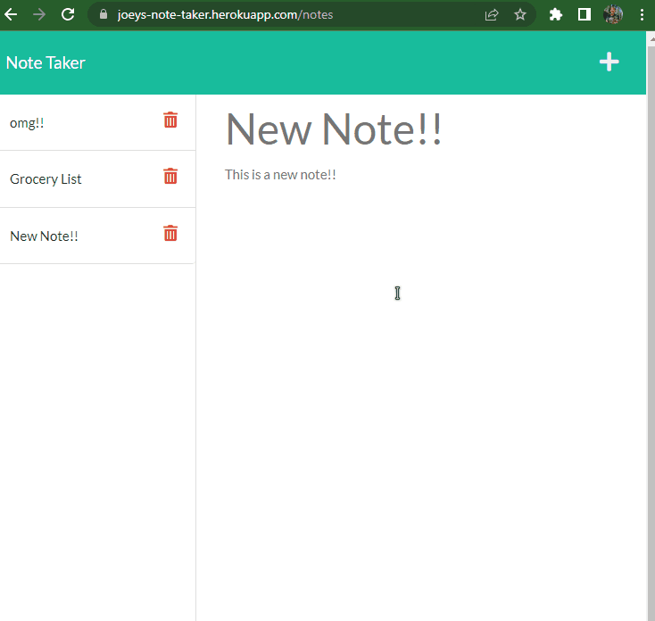

# **Note Taker**
 
## **Description**
A simple note taker app which can be used to write and save notes. This application uses Express.js for the back end.

## **Table of Contents**
1. [Installation](#installation)
2. [Usage](#usage)
3. [Technologies](#technologies)
4. [Credits](#credits)
5. [License](#license)

## **Installation**
To properly install all the node modules for this app on your own device, please be sure to `npm install` before using. To use the app however you will not need to install anything.

## **Usage**
To use the app you can simply visit the site <a href="https://joeys-note-taker.herokuapp.com/" target="_blank">here</a>.

If you are installing the app and using it on your own device, make sure to use the `npm start` command to start the server. Once you have done that you should navigate to <a href="http://localhost:3000/" target="_blank">this link</a>. 

*Please note that the above link will only work if you have the server running already.*

Once you are on the app you will have to click on the `Get Started` button to get started.

You can also navigate using the HTML query as shown in the above animation.

Once you have entered the notes page, you can view, add or delete notes!

As shown in the above animation, you can type in new note content and then press the save button to save the note to the list on the left-hand side of the page.

You can also simply delete notes by clicking on the trash can button.

*Please note that you will not be able to get any notes back once they are deleted. This is a permanent deletion.*

## **Technologies**

The technologies used in this app include:
* [Node.js](https://nodejs.org/en/)
    * [uuid module](https://www.npmjs.com/package/uuid)
* [Express.js](https://expressjs.com/)

## **Credits**
This app wouldn't have been possible to make without the technologies listed above. Node.js and Express.js are doing some heavy lifting when it comes to processing routing and reading/writing to files.

The author of this app is [coderbennett](https://github.com/coderbennett).

## **License**
This application is licensed under the Apache 2.0 license. You may view the license by visiting the [LICENSE](LICENSE.txt) document.